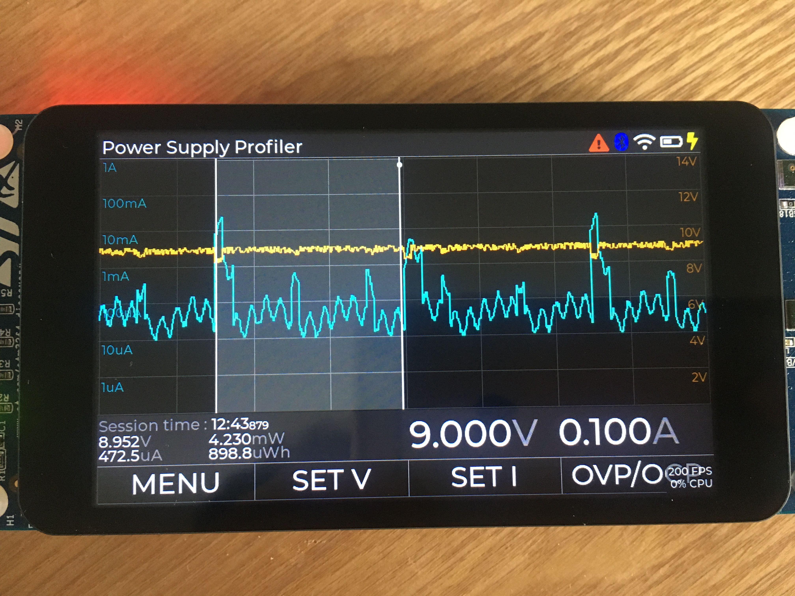

# Energy Profiling Power Supply proof-of-concept GUI

## Project Introduction

This is a proof of concept GUI design based on LVGL and rt-thread running on the STM32F469 Discovery kit.

The goal is to demonstrate what kind of graphical user interface could be designed to run alongside a bench power supply with high speed current and voltag measurement capability for power consumption profiling.

To profile an hardware project power consumption, graphical representation of the current is key, as well as real-time statistics like average voltage/current/power/energy over a selectable period of time. This project suggests a GUI to do that. Also, since most low power devices have a big range of current consumption (from nA for low power modes to hundreds of mA while sending RF packet), a log scale has been used to display the current. This log scale is usefull to see details during low power operation while keeping an eye n the current peak for RF transmission for example.

This project is an humble submission to the rt-thread Embedded GUI Contest. Due to lack of time, it's mostly a GUI mock, but that could easily be connected to real function (data aquisition using high speed ADC, statistics calculation, menu etc). The graph could also be improved to be updated in real time but it would require significant optimization to avoid tearing effect : in fact, even with the chromART accelerator, refreshing the whole graph area takes a significant amount of CPU. To further optimize the user experience, a rotary encoder could be added to set the voltage/current settings, because touch screens are not really optimized for this kind of settings and nothing beat an encoder on a lab equipment.
